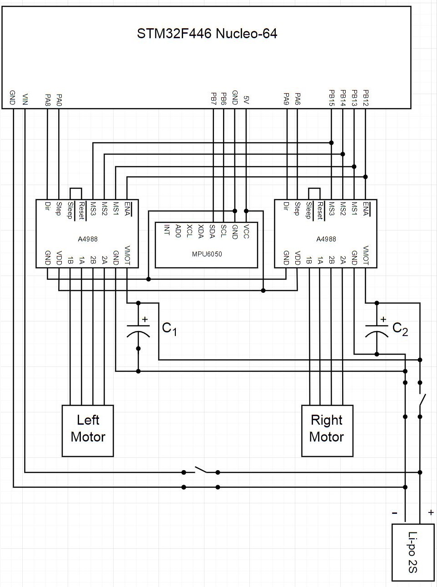

# 平衡車_步進馬達版本

  

[影片展示](#影片展示)

專案開始日期：2021 年 9 月 18 日

平衡車 ( 或稱兩輪自平衡機器人 )，是一種不穩定的系統，也就是說如果不對平衡車進行控制的話，車子始終會往某個方向倒下，為了保持平衡，需要利用姿態感測器感測目前車體的狀態 ( 車體的傾斜角度與角速度 )，經過控制器來控制馬達的旋轉方向與速度，藉此改變車體的狀態來維持平衡。

我做平衡車主要有兩個原因：
1. 以前只有在上課的時候使用過 ST 的板子，礙於時間關係所以教的也不多，目前想往嵌入式的方向走，所以想更深入的學習 ST 的板子。
2. 平衡車是一種典型的類倒單擺系統，具有欠驅動、非線性、不穩定等特性，常被用來測試控制算法的效果，是一個很好的實驗平台，未來要把我學過的控制算法用在平衡車上試試。在學期間有做過一台旋轉型倒單擺，花實驗室的錢買的材料所以就留在實驗室了，哈哈，沒做紀錄挺可惜的，所以這次就換做平衡車吧~

---

平衡車主要由三個部分組成：控制器、馬達和感測器。手邊剛好有一塊 STM32F446 Nucleo-64 boards 就拿來當作平衡車的控制器，雖然整個板放上去有點大有點醜但不太影響功能 ( 未來想自己做一個板出來，應該可以小很多 )，控制算法先使用常見的並行 PID 控制器，先能夠成功平衡再嘗試把控制算法換成別的。馬達使用兩相四線的 42步進馬達搭配 A4988 步進細分驅動器，雖然用直流減速馬達來做的人好像比較多，但我以前做的旋轉型倒單擺就是用直流減速馬達，這次就換步進馬達來做。感測器我使用常見的 MPU6050 姿態感測器透過卡爾曼濾波器計算可靠的角度值。

  

控制系統：

  

我用的步進馬達是沒有回授的，屬於開迴路控制，所以沒辦法像有編碼器的馬達一樣回授馬達轉速，但因為步進馬達的指令追隨性非常高 ( 響應快 ) 且它的旋轉速度取決於輸入脈波的頻率，所以只要確保不會發生失步的話，意味著我給多快的頻率 ( 可換算成轉速 ) 它就轉多快，所以把頻率換算成轉速直接回授也是可以的。

---

- 硬體
    - STM32F446 Nucleo-64 boards *1
    - MPU6050 *1
    - 兩相四線 42步進馬達 *2
    - A4988 步進細分驅動器 *2
    - 100uF 電解電容 *2 ( C1 = C2 = 100uF )
    - 兩段滑動開關 *2
    - Lipo 2S 電池 *1
    - 65mm 車輪 *2
    - 車架、銅柱跟一些連結線

  

# 影片展示

---

要幾乎靜止的原地平衡似乎不容易，要花很多時間調整 PID 參數，所以我只要它能夠達成基本的平衡能力就好，PID 參數調整的部分就沒有太琢磨，所以看起來有點軟，但至少確定不會倒，未來再換別的控制算法來試試看效果。
